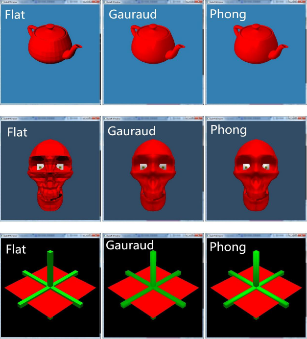

## Concept

In [3D computer graphics](https://en.wikipedia.org/?wiki/3D_computer_graphics), the **rendering pipeline** refers to the sequence of steps used to create a 2D raster representation of a 3D scene. Plainly speaking, once a 3D model has been created, for instance in a video game or any other 3D computer animation, the graphics pipeline is the process of turning that 3D model into what the computer displays. In the early history of 3D computer graphics, fixed purpose hardware was used to speed up the steps of the pipeline through a [fixed-function](https://en.wikipedia.org/wiki/Fixed-function) pipeline. Later, the hardware evolved, becoming more general purpose, allowing greater flexibility in graphics rendering as well as more generalized hardware, and allowing the same generalized hardware to perform not only different steps of the pipeline, like in fixed purpose hardware, but even in limited forms of general purpose computing. As the hardware evolved, so did the graphics pipelines, the [OpenGL](https://en.wikipedia.org/wiki/OpenGL), and [DirectX](https://en.wikipedia.org/wiki/DirectX) pipelines, but the general concept of the pipeline remains the same.

**[Direct3D 11 programmable pipeline]****[Direct3D 11 programmable pipeline]**

***

### What I have done
 

#### Mid Point Algorithm

> Implemented mid point line algorithm, which is a basic and efficient algorithm in my rendering pipeline, to draw lines between vertices

**Bresenham's line algorithm** is an algorithm that determines the points of an n-dimensional raster that should be selected in order to form a close approximation to a straight line between two points. It is commonly used to draw lines on a computer screen, as it uses only integer addition, subtraction and bit shifting, all of which are very cheap operations in standard computer architectures. It is one of the earliest algorithms developed in the field of computer graphics. An extension to the original algorithm may be used for **drawing circles**.

**Midpoint circle algorithm** is an algorithm used to determine the points needed for drawing a circle. Bresenham's circle algorithm is derived from the midpoint circle algorithm. The algorithm can be generalized to conic sections. The algorithm is related to work by Pitteway and Van Aken.

 

 

#### Rendering pipeline 
 

> Implemented main stages of the rendering pipeline

* **3D geometric primitives**

First, the scene is created out of geometric primitives. Traditionally this is done using triangles, which are particularly well suited to this as they always exist on a single plane.

* **Modelling and transformation**

Transform from the local coordinate system to the 3d world coordinate system. A model of a teapot in abstract is placed in the coordinate system of the 3d world.

* **Camera transformation**

Transform the 3d world coordinate system into the 3d camera coordinate system, with the camera as the origin.

* **Lighting**

Illuminate according to lighting and reflectance. If the teapot is a brilliant white color, but in a totally black room, then the camera sees it as black. In this step the effect of lighting and reflections are calculated.

* **Projection transformation**

Transform the 3d world coordinates into the 2d view of the camera, for instance the object the camera is centered on would be in the center of the 2d view of the camera. In the case of a Perspective projection, objects which are distant from the camera are made smaller. This is achieved by dividing the X and Y coordinates of each vertex of each primitive by its Z coordinate(which represents its distance from the camera). In an orthographic projection, objects retain their original size regardless of distance from the camera.

* **Clipping**

Geometric primitives that now fall completely outside of the viewing frustum will not be visible and are discarded at this stage.

* **Scan conversion or rasterization**

Rasterization is the process by which the 2D image space representation of the scene is converted into raster format and the correct resulting pixel values are determined. From now on, operations will be carried out on each single pixel. This stage is rather complex, involving multiple steps often referred as a group under the name of pixel pipeline.

* **Texturing, fragment shading**

At this stage of the pipeline individual fragments (or pre-pixels) are assigned a color based on values interpolated from the vertices during rasterization, from a texture in memory, or from a shader program.

 

#### Shading Methods
 

> Implemented three shading methods : Flat Shading, Gauraud Shading and Phong Shading

* **Flat Shading**

Flat shading is lighting technique used in 3D computer graphics. It shades each polygon of an object based on the angle between the polygon's surface normal and the direction of the light source, their respective colors and the intensity of the light source. It is usually used for high speed rendering where more advanced shading techniques are too computationally expensive.

The disadvantage of flat shading is that it gives low-polygon models a **faceted look**. Sometimes this look can be advantageous though, such as in modeling boxy objects. Artists sometimes use flat shading to look at the polygons of a solid model they are creating. More advanced and realistic lighting and shading techniques include **Gouraud shading** and **Phong shading**.

* **Gauraud Shading**

Gouraud shading is used to achieve smooth lighting on low-polygon surfaces without the heavy computational requirements of calculating lighting for each pixel. The technique was first presented by [Henri Gouraud](https://en.wikipedia.org/wiki/Henri_Gouraud_(computer_scientist)) in 1971.

The basic principle behind the method is to calculate the surface normals at the vertices of polygons in a 3D computer model. These normals are then averaged for all the polygons that meet at each point. Lighting computations are then performed to produce colour intensities at vertices. The lighting calculation used by Gouraud was based on the [Lambertian reflectance](https://en.wikipedia.org/wiki/Lambertian_reflectance).

* **Phong Shading**

Phong shading refers to an interpolation technique for surface shading in 3D computer graphics. It is also called Phong interpolation or normal-vector interpolation shading. Specifically, it interpolates surface normals across rasterized polygons and computes pixel colors based on the interpolated normals and a reflection model. Phong shading may also refer to the specific combination of Phong interpolation and the Phong reflection model.

 

#### Some Parts of My Code
 

* **Lighting**

Lighting equation: `color = ambient + diffuse + specular`


double sumDiffuse = 0.0;
double sumSpecular = 0.0;
mVector vVector(wsPoint, viewPoint);
vVector.normalize();
for (int l = 0; l < lightCounter; l++)
{
	mVector lVector(wsPoint, mLight[l].p);
	lVector.normalize();

	mVector rVector = nVector * (2 * nVector.dotMul(lVector)) - lVector;
	rVector.normalize();
	double mulRV = rVector.dotMul(vVector);
	if (mulRV > 0)
		sumSpecular += Ks * mLight[l].Ip * pow(mulRV, N);
	if (nVector.dotMul(lVector)>0)
		sumDiffuse += Kd * mLight[l].Ip * (nVector.dotMul(lVector));
}
double fatt = 1.0;	
rrr = Ka * tmp.r  + fatt * sumDiffuse * tmp.r + sumSpecular * tmp.r;
ggg = Ka * tmp.g  + fatt * sumDiffuse * tmp.g + sumSpecular * tmp.g;
bbb = Ka * tmp.b  + fatt * sumDiffuse * tmp.b + sumSpecular * tmp.b;


* **Functions Used for Mid Point Line Algorithm**

Variables `z1` and `z2` are used for Z-Buffer. `drawLine1`, `drawLine2`, `drawLine3` and `drawLine4` are the sub-functions of `drawLine`, which will be called respectively when considering different slope of the lines.


void drawLine(int x0, int x1, int y0, int y1, double r, double g, double b, double z0=0, double z1=0);
void drawLine1(int x0, int x1, int y0, int y1, double r, double g, double b, double z0=0, double z1=0);
void drawLine2(int x0, int x1, int y0, int y1, double r, double g, double b, double z0=0, double z1=0);
void drawLine3(int x0, int x1, int y0, int y1, double r, double g, double b, double z0=0, double z1=0);
void drawLine4(int x0, int x1, int y0, int y1, double r, double g, double b, double z0=0, double z1=0);


* **Clipping**

Clipping could be implemented simply by the following `if` sentence. However, it's inefficient because of the large amount of dots. Implementing line clipping before `drawDot()` instead of judging `z` in `drawDot()` would be better.


void drawDot(int x, int y, double r, double g, double b, double z) 
{
	if (!isInView(x, y) || !(z>=0 && z<=1)) return;
	glBegin(GL_POINTS);
	glColor3f(r, g, b);
	glVertex2i(x, y);
	glEnd();
}


* **Calculating the Average Normal Vector of the Points**


for (int i=0;i<tmp.numFace;i++)
{
	int index1 = tmp.face[i][0] - 1;
	int index2 = tmp.face[i][1] - 1;
	int index3 = tmp.face[i][2] - 1;
	mVector v1(tmp.p[index1], tmp.p[index2]);
	mVector v2(tmp.p[index2], tmp.p[index3]);
	mVector nVector = v2 * v1;
	nVector.normalize();
	for (int j=0;j<tmp.facePointNum[i];j++)
	{
		int index = tmp.face[i][j] - 1;
		tmp.pointVector[index] += nVector;
	}
}


 

#### Results
 

***

