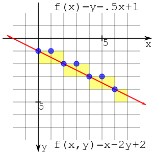

## Concept

In [3D computer graphics](https://en.wikipedia.org/?wiki/3D_computer_graphics), the **rendering pipeline** refers to the sequence of steps used to create a 2D raster representation of a 3D scene. Plainly speaking, once a 3D model has been created, for instance in a video game or any other 3D computer animation, the graphics pipeline is the process of turning that 3D model into what the computer displays. In the early history of 3D computer graphics, fixed purpose hardware was used to speed up the steps of the pipeline through a [fixed-function](https://en.wikipedia.org/wiki/Fixed-function) pipeline. Later, the hardware evolved, becoming more general purpose, allowing greater flexibility in graphics rendering as well as more generalized hardware, and allowing the same generalized hardware to perform not only different steps of the pipeline, like in fixed purpose hardware, but even in limited forms of general purpose computing. As the hardware evolved, so did the graphics pipelines, the [OpenGL](https://en.wikipedia.org/wiki/OpenGL), and [DirectX](https://en.wikipedia.org/wiki/DirectX) pipelines, but the general concept of the pipeline remains the same.

**[Direct3D 11 programmable pipeline]****[Direct3D 11 programmable pipeline]**

***

## Stages of the rendering pipeline 
 

#### 3D geometric primitives

First, the scene is created out of geometric primitives. Traditionally this is done using triangles, which are particularly well suited to this as they always exist on a single plane.

#### Modelling and transformation

Transform from the local coordinate system to the 3d world coordinate system. A model of a teapot in abstract is placed in the coordinate system of the 3d world.

#### Camera transformation

Transform the 3d world coordinate system into the 3d camera coordinate system, with the camera as the origin.

#### Lighting

Illuminate according to lighting and reflectance. If the teapot is a brilliant white color, but in a totally black room, then the camera sees it as black. In this step the effect of lighting and reflections are calculated.

#### Projection transformation

Transform the 3d world coordinates into the 2d view of the camera, for instance the object the camera is centered on would be in the center of the 2d view of the camera. In the case of a Perspective projection, objects which are distant from the camera are made smaller. This is achieved by dividing the X and Y coordinates of each vertex of each primitive by its Z coordinate(which represents its distance from the camera). In an orthographic projection, objects retain their original size regardless of distance from the camera.

#### Clipping

Geometric primitives that now fall completely outside of the viewing frustum will not be visible and are discarded at this stage.

#### Scan conversion or rasterization

Rasterization is the process by which the 2D image space representation of the scene is converted into raster format and the correct resulting pixel values are determined. From now on, operations will be carried out on each single pixel. This stage is rather complex, involving multiple steps often referred as a group under the name of pixel pipeline.

#### Texturing, fragment shading

At this stage of the pipeline individual fragments (or pre-pixels) are assigned a color based on values interpolated from the vertices during rasterization, from a texture in memory, or from a shader program.

***

## What I have done
 

#### Mid Point Algorithm

>**Bresenham's line algorithm** is an algorithm that determines the points of an n-dimensional raster that should be selected in order to form a close approximation to a straight line between two points. It is commonly used to draw lines on a computer screen, as it uses only integer addition, subtraction and bit shifting, all of which are very cheap operations in standard computer architectures. It is one of the earliest algorithms developed in the field of computer graphics. An extension to the original algorithm may be used for **drawing circles**.

>**Midpoint circle algorithm** is an algorithm used to determine the points needed for drawing a circle. Bresenham's circle algorithm is derived from the midpoint circle algorithm. The algorithm can be generalized to conic sections. The algorithm is related to work by Pitteway and Van Aken.

 

#### Mid Point Algorithm
